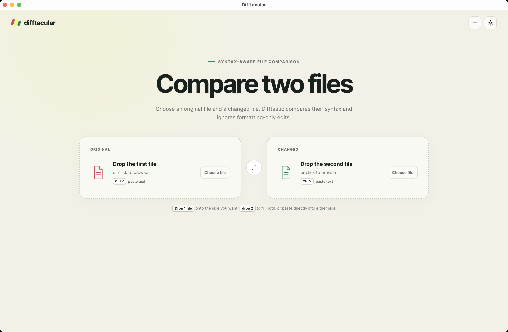

# Difftacular

Difftacular is a desktop app for comparing two files with
[Difftastic](https://github.com/Wilfred/difftastic)'s syntax-aware diff engine.
Drop in a pair of files, choose them in the file picker, or paste text into
either side. The comparison stays on your computer.



## Install on macOS

Difftacular does not have packaged releases yet. For now, build it from this
repository. Install the [Rust toolchain](https://rustup.rs/) and
[`just`](https://github.com/casey/just) first. Then clone this branch and install
the Tauri CLI:

```sh
git clone --branch feature/difftastic-studio \
  https://github.com/scp-forks/difftastic.git difftacular
cd difftacular
cargo install tauri-cli --version 2.11.4 --locked
just install-studio
```

The last command builds a release app, installs it at
`~/Applications/Difftacular.app`, registers it with macOS, and opens it. Run the
same command after pulling new changes. Difftacular will also appear in Raycast
and other application launchers.

If you only want to run the app from a source checkout:

```sh
just studio
```

## Use it

Drag one file onto the Original or Changed card to put it on that side. Drop two
files anywhere in the window to fill both sides and compare them immediately.
You can also click a card to browse for a file.

To compare text from the clipboard, hover over or focus a side and press
<kbd>Command</kbd>+<kbd>V</kbd>. After the first paste, Difftacular selects the
empty side for the second one.

Once a comparison is open, you can:

- move between changes;
- change the number of context lines;
- ignore comments or whitespace at the edges of lines;
- normalize CRLF line endings;
- wrap long lines;
- swap the original and changed inputs;
- switch between light and dark themes.

Difftacular uses Difftastic's language detection and structural matcher. For an
unknown file type, it falls back to a line-oriented diff with word
highlighting. See Difftastic's
[supported languages](https://difftastic.wilfred.me.uk/languages_supported.html)
for the current list.

## Relationship to Difftastic

This repository is a downstream fork of
[Wilfred Hughes's Difftastic](https://github.com/Wilfred/difftastic).
Difftacular is the desktop frontend maintained on the
`feature/difftastic-studio` branch. 

The app calls the Difftastic library in this repository, so its parsing and
structural comparison come from the same Rust implementation as the `difft`
command-line tool. Difftacular adds the Tauri desktop interface and a visual
adapter for that output. It is not an official Difftastic release.

For the command-line tool, its configuration, and details about the diff
algorithm, use the [Difftastic manual](https://difftastic.wilfred.me.uk/).

## Development

The desktop app lives under [`visual/`](visual/README.md). Its frontend is plain
HTML, CSS, and JavaScript. Tauri calls the Rust adapter in the repository root.

Run the app from the repository root:

```sh
just studio
```

Useful checks while working on it:

```sh
cargo test --lib
cargo test --manifest-path visual/src-tauri/Cargo.toml
```

The pinned Rust version is recorded in `rust-toolchain.toml`.

## License

Difftacular and Difftastic are available under the MIT license. See
[`LICENSE`](LICENSE). The tree-sitter parsers under `vendored_parsers/` retain
their own MIT or Apache licenses.
